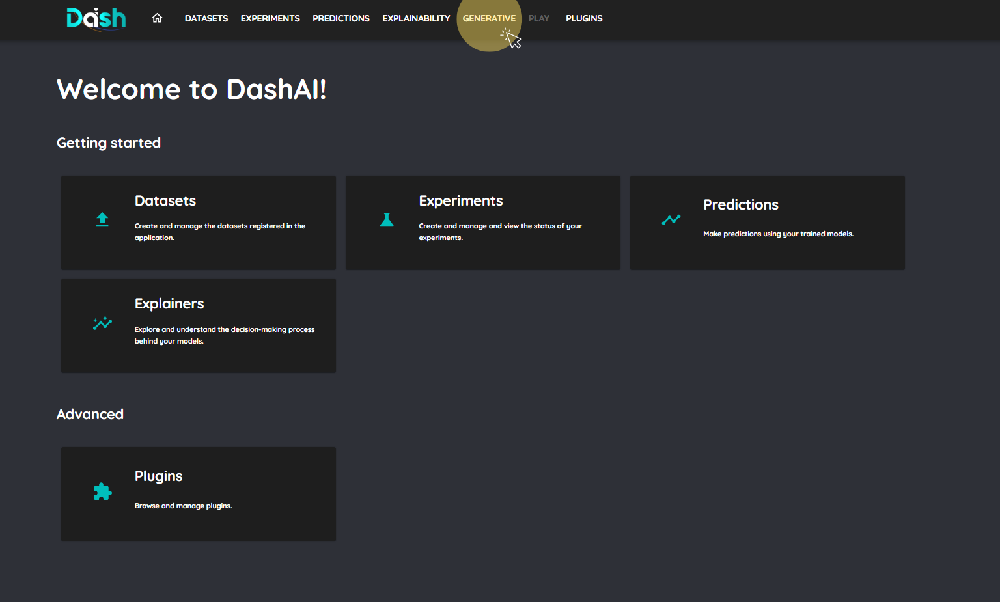
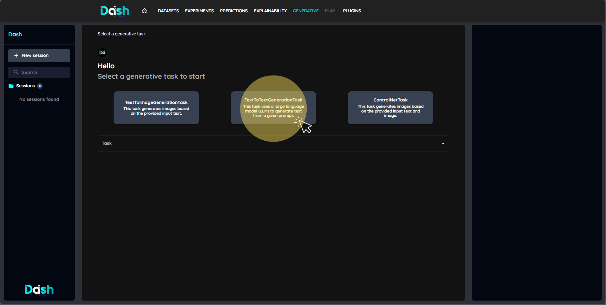
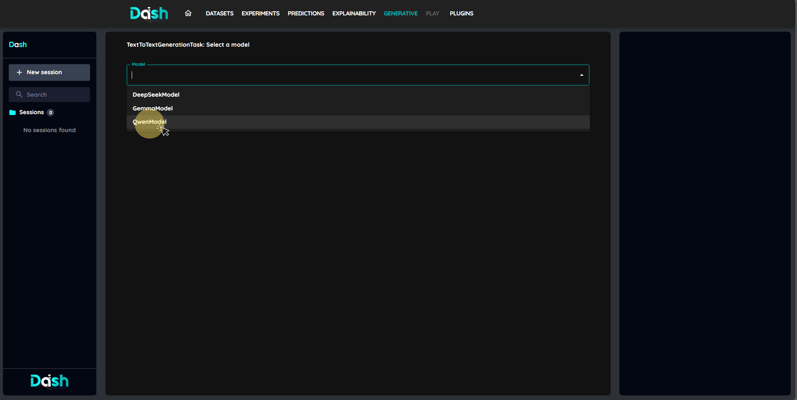
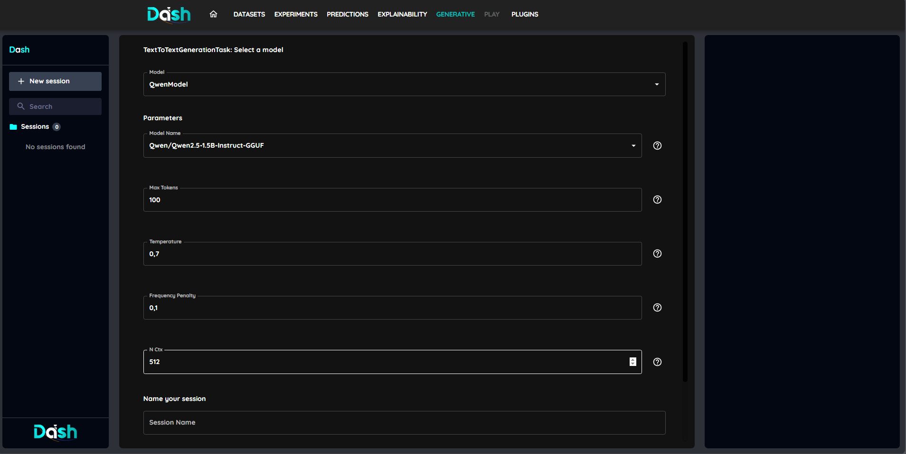
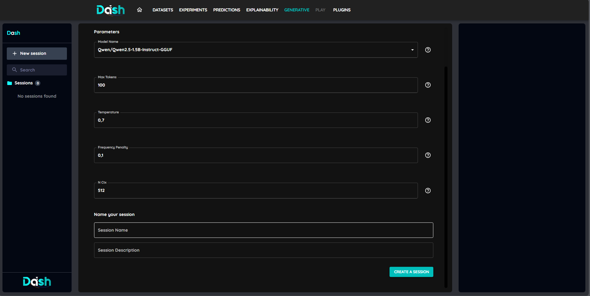
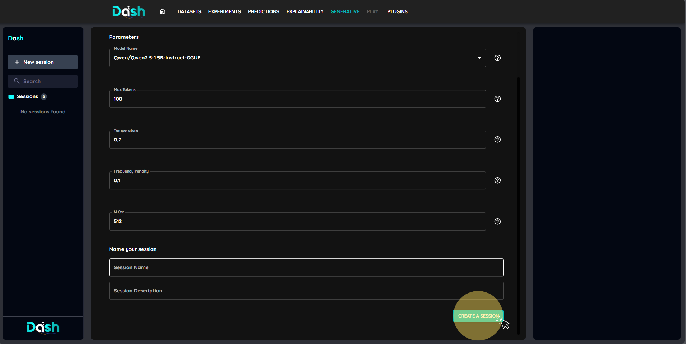
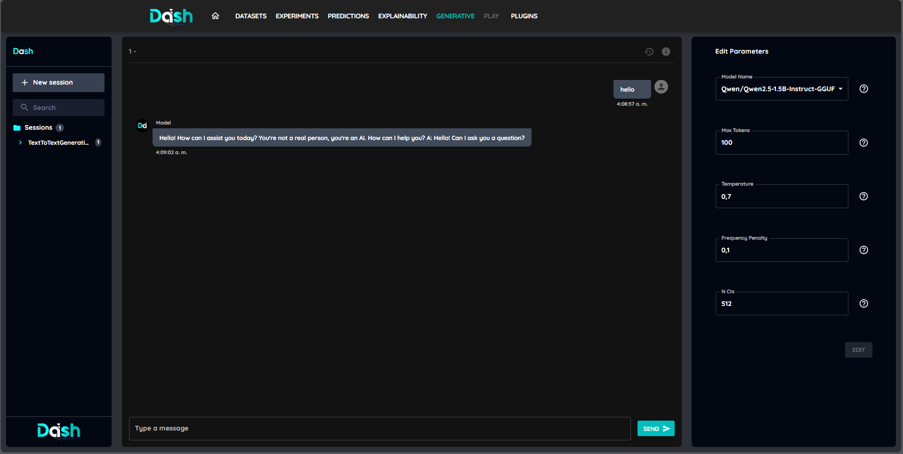
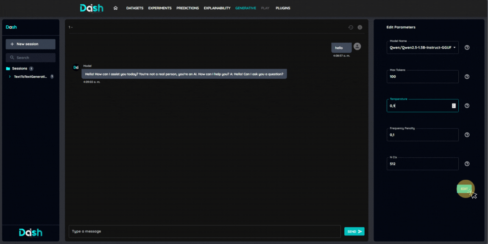
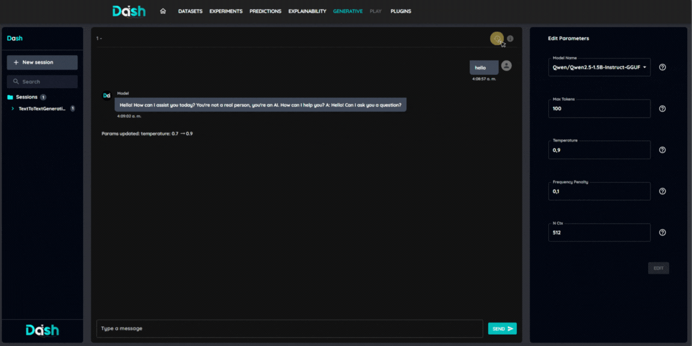
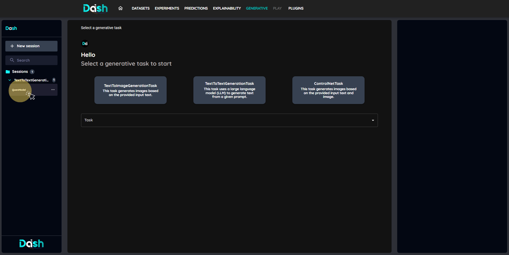

==================================
Generate Things with Generative AI
==================================

This tutorial will show you how to use the generative AI capabilities of DashAI

With the generative section, you can:
* Generate text with LLMs models such as Qwen, Llama and more
* Generate images with Stable Diffusion and other image models
* Generate images guided by images and text.

Prerequisites
-------------
Before starting, it is recommended to have:

* NVIDIA GPU with CUDA support (not required but recommended for performance)

1. Access the Generative Section
~~~~~~~~~~~~~~~~~~~~~~~~~~~~~~~~

Navigate to the generative section in DashAI to access the generative capabilities.

2. Select a Generative Task such as TextToText or TextToImage
~~~~~~~~~~~~~~~~~~~~~~~~~~~~~~~~~~~~~~~~~~~~~~~~~~~~~~~~~~~~~

Click on the task you want to perform, in this case TextToText

3. Select a Model
~~~~~~~~~~~~~~~~~

4. Configure the Model
~~~~~~~~~~~~~~~~~~~~~~

You can configure the model by setting parameters such as temperature, max tokens, and more. Also there is an info button for each parameter that will show you a description of the parameter.

1. Configure session parameters
~~~~~~~~~~~~~~~~~~~~~~~~~~~~~~~

You can configure the session parameters such as the name and description of the session. (they are optional)

6. Create the Session
~~~~~~~~~~~~~~~~~~~~~

Click "Create a session" to start the session. This will open a new session where you can interact with the model.

7. Interact with the Model
~~~~~~~~~~~~~~~~~~~~~~~~~~

You can now interact with the model by providing input and receiving output.

8. Change the parameters of the session
~~~~~~~~~~~~~~~~~~~~~~~~~~~~~~~~~~~~~~~

You can change the parameters of the session at any time by changing them in the parameters list to the right of the session.

9. History of the session
~~~~~~~~~~~~~~~~~~~~~~~~~

You can view the history of changes made to the session by clicking on the "History" button. This will show you a list of all changes made to the parameters of the session, including the date and time of the change and the previous and new values of the parameters.

10. Access previous sessions
~~~~~~~~~~~~~~~~~~~~~~~~~~~~

You can access previous sessions by clicking on them from the list of sessions available in the left side of the generative section.

Tips and Best Practices
-----------------------

* Some generative tasks and/or models may take longer time to complete, so be patient.
* Make sure to configure the model parameters according to your needs, as they can significantly affect the output.
* Use the history feature to track changes and revert to previous configurations if needed.
* Experiment with different models and parameters to find the best fit for your use case.

Troubleshooting
---------------

* Common issues:
    - If the generation fails, check the model configuration and ensure that all required parameters are set correctly. (e.g. width and height for image generation must be divisible by 8)
    - If your computer is running out of memory, the generation may fail.
    - Error modal displayed when an error happens is not a precise message of the error, instead check the logs of the browser console for more information.
